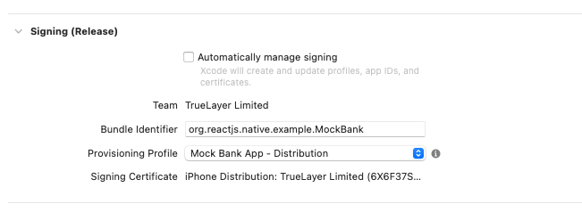
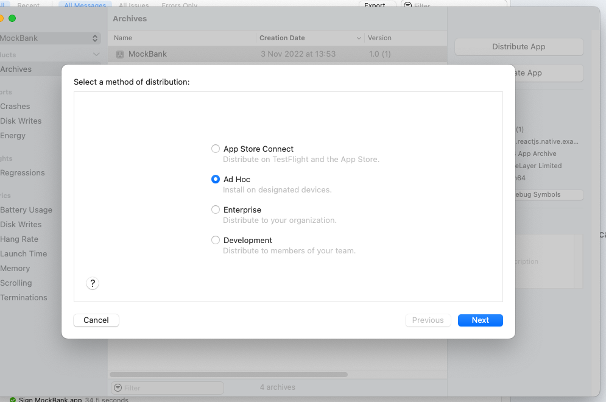
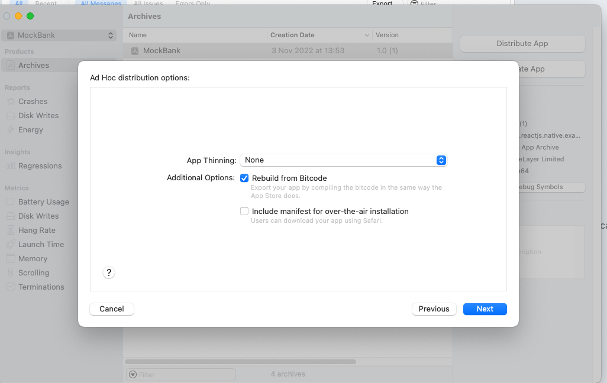
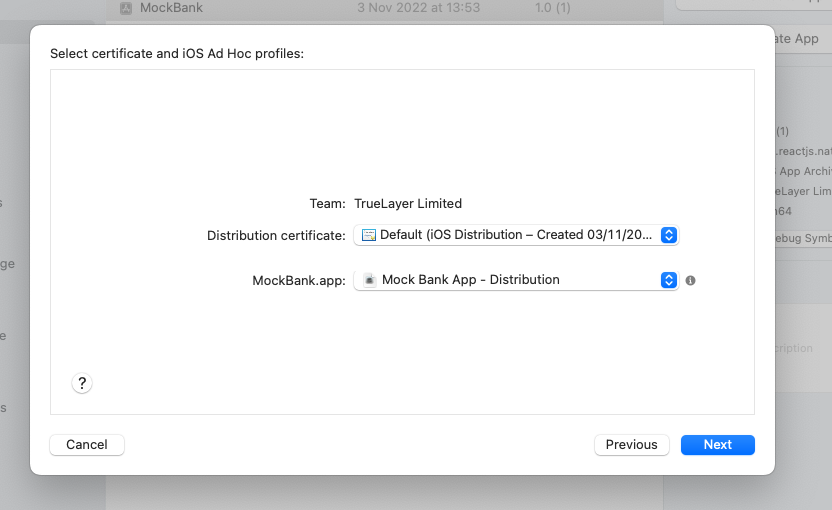
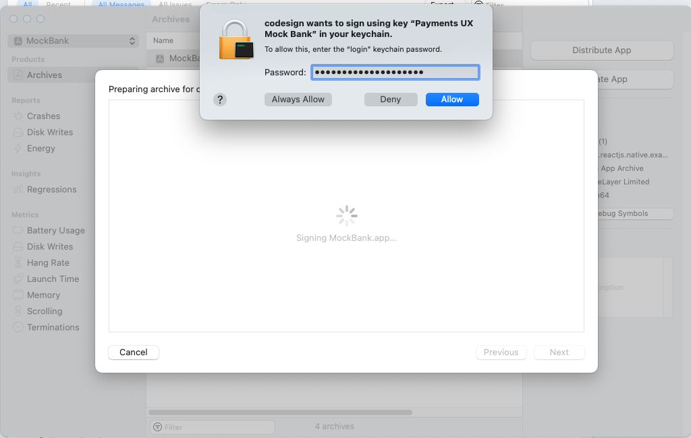
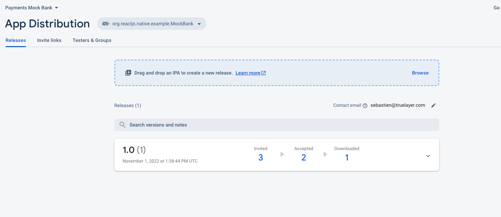
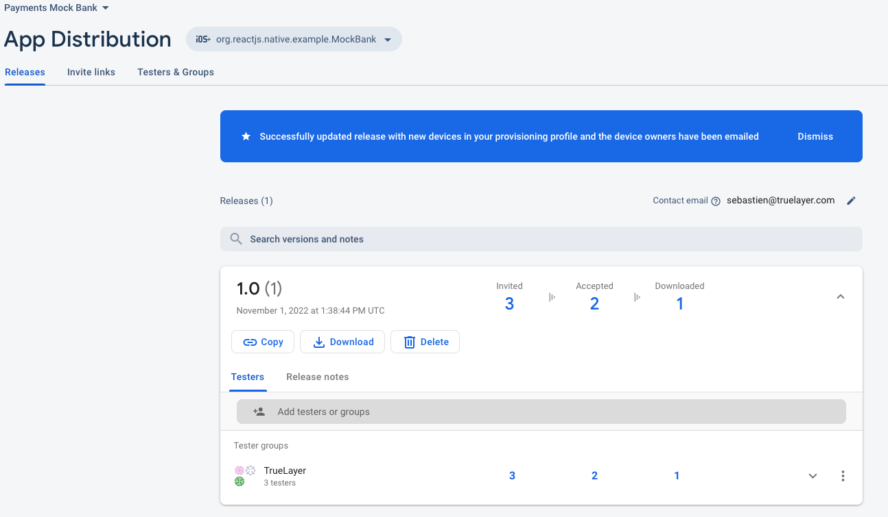
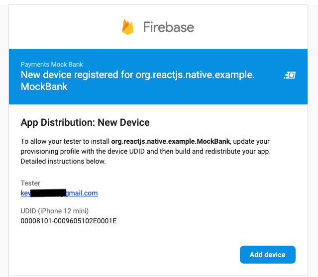
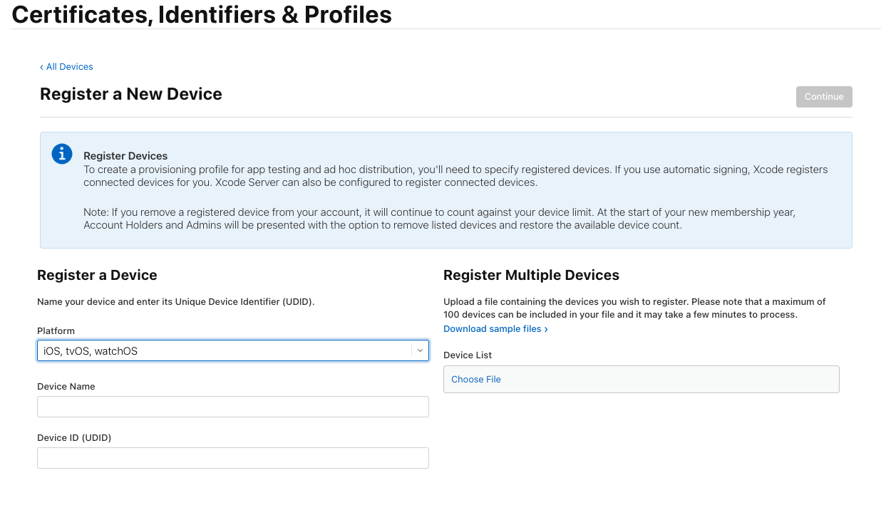

# Release Process & Firebase Configuration

 

The release for the Android App is relatively straightforward as we can simply share an APK to people interested in testing it.
For iOS, the release process is quite a bit more complex as we can't simply share binaries app around.
As such, we decided to start working with [Firebase App Distribution](https://firebase.google.com/docs/app-distribution), it allows for relatively easy upload of IPA Files (iOS Application files) and controlling testers and what versions they have access to.
While the upload process is relatively straightforward, the actual sharing and installation on additional devices is much less so [see below.](#adding-ios-testers).

 

Another important constraint on iOS (but not limited to firebase), is that we're limited to 100 device types we can add (100 iPhones, 100 iPads, etc...).
 
If we were to reach that limit, we could spend more time investigating [Apple TestFlight](https://developer.apple.com/testflight/). 
 
See [this Stackoverflow post](https://stackoverflow.com/a/43536224) for a more detailed breakdown of the different options as well as their pros/cons.

## iOS App Signing

### 1) Add Distribution Certificate to your Keychain:
- https://developer.apple.com/account/resources/certificates/download/VL6629AFNG
- Add certificate to Keychain (ios_distribution.ecr file)

### 2) Add Profile to the signing configuration:
- Download https://developer.apple.com/account/resources/profiles/review/59PY74B6Q7
- Add the signing configuration to the XCode Project  

 

### 3) Archive and Release
- Archive the project from XCode
- Once it's done (takes a few minutes), go through the final distribution wizard
 

 

### 4) Upload the updated IPA to Firebase

 

 
 

## Adding iOS Testers

Based on Firebase guide: (register additional devices)[https://firebase.google.com/docs/app-distribution/register-additional-devices]

When a tester accepts an invitation to test your app, App Distribution requests permission to share the tester's device identifier with you, the developer. Before downloading an ad hoc build, App Distribution asks the tester to register their device. If the tester registers their device, App Distribution collects the UDID from the device and notifies you of the UDID by email.

Once this step is done, you should receive an email with the device UUID and copy the UUID to Register a New Device on the Apple Developer platform:
 

Once this is done repeat [Step 2 of the iOS Release](#2-add-profile-to-the-signing-configuration)

